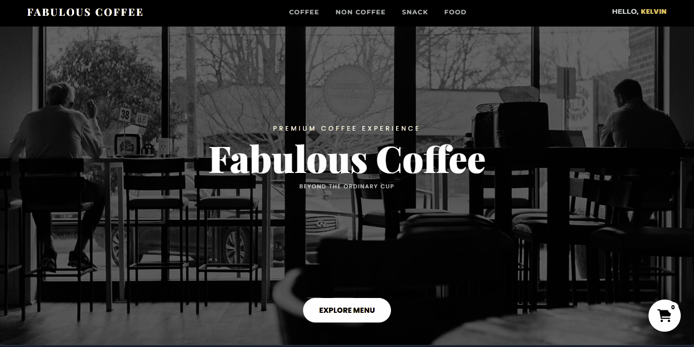

# ☕ Fabulous Coffee

> **Beyond The Ordinary Cup** — Aplikasi pemesanan kopi berbasis web.

Dibangun dengan **Flask** + **MySQL** sebagai project akhir mata kuliah OOP.

---

## 👥 Tim Pengembang

| Nama | NIM |
|------|-----|
| Vio Lefrans | 32250095 |
| Igun Gunawan | 32250094 |
| Kelvin Filemon | 32250077 |

---

## ✨ Fitur

- 🔐 Register & Login dengan password hashing
- 🎠 Slider best seller yang smooth & infinite
- 📋 Menu per kategori (Coffee, Non-Coffee, Snack, Food)
- 🔍 Detail produk dengan gambar
- 🛒 Keranjang belanja (Add, Remove, Quantity)
- ✅ Checkout & update status pesanan ke database
- 👤 Navbar menampilkan nama user yang sedang login
- 📱 Responsive design

---

## 🛠️ Teknologi

| Teknologi | Kegunaan |
|-----------|----------|
| Python 3 | Backend |
| Flask | Web Framework |
| MySQL | Database |
| mysql-connector-python | Koneksi Python ke MySQL |
| Werkzeug | Password hashing |
| python-dotenv | Environment variable |
| HTML / CSS / JS | Frontend |
| Font Awesome | Icon |
| Google Fonts | Playfair Display & Montserrat |

---

## 📦 Instalasi & Setup

### 1. Clone repository

```bash
git clone https://github.com/IgunGunawanWWW/project_OOP.git
cd project_OOP
```

### 2. Install dependencies

```bash
pip install flask mysql-connector-python werkzeug python-dotenv
```

### 3. Jalankan XAMPP

Pastikan **Apache** dan **MySQL** sudah berjalan di XAMPP.

### 4. Setup database

Buka MySQL Workbench atau phpMyAdmin, lalu jalankan file:

```
sql/setup.sql
```

Atau jalankan manual:

```sql
CREATE DATABASE IF NOT EXISTS kopi_db;
USE kopi_db;
```

Kemudian jalankan semua file SQL di folder `sql2/` berurutan:
1. `kopi_db_users.sql`
2. `kopi_db_kategori.sql`
3. `kopi_db_menu.sql`
4. `kopi_db_pesanan.sql`
5. `kopi_db_detail_pesanan.sql`

### 5. Buat file `.env`

Buat file `.env` di root folder (sejajar dengan `main.py`):

```env
DB_HOST=localhost
DB_USER=root
DB_PASSWORD=
DB_NAME=kopi_db
```

> Sesuaikan `DB_PASSWORD` jika MySQL kamu menggunakan password.

### 6. Jalankan aplikasi

```bash
python main.py
```

Buka browser:

```
http://127.0.0.1:5000
```

---

## 📁 Struktur Project

```
project_OOP/
├── models/
│   └── database.py           # Koneksi database
├── routes/
│   └── auth.py               # Semua route aplikasi
├── sql/
│   ├── setup.sql             # Setup lengkap (jalankan ini)
│   ├── kopi_db_users.sql
│   ├── kopi_db_kategori.sql
│   ├── kopi_db_menu.sql
│   ├── kopi_db_pesanan.sql
│   └── kopi_db_detail_pesanan.sql
├── static/
│   ├── CSS/
│   │   ├── style.css         # CSS halaman auth
│   │   └── style_main.css    # CSS halaman utama
│   ├── images/
│   │   ├── menu/             # Foto slider best seller
│   │   ├── coffee/           # Foto kategori coffee
│   │   ├── non-coffee/       # Foto kategori non-coffee
│   │   ├── snack/            # Foto kategori snack
│   │   └── food/             # Foto kategori food
│   └── js/
│       └── script.js         # JavaScript
├── templates/
│   ├── index.html            # Landing page
│   ├── login.html            # Halaman login
│   ├── register.html         # Halaman register
│   └── main.html             # Halaman utama
├── .env                      # Konfigurasi database (tidak di-push)
└── main.py                   # Entry point
```

---

## 🗄️ Struktur Database

```
users ──< pesanan ──< detail_pesanan >── menu >── kategori
```

| Tabel | Keterangan |
|-------|------------|
| `users` | Data akun pengguna |
| `kategori` | Kategori menu |
| `menu` | Daftar produk & harga |
| `pesanan` | Header transaksi |
| `detail_pesanan` | Item per transaksi |

---

## 🚀 Cara Penggunaan

1. Buka `http://127.0.0.1:5000`
2. Klik **Daftar** untuk membuat akun baru
3. **Login** dengan email dan password
4. Browse menu — klik card untuk melihat detail & pilih jumlah
5. Klik **+** untuk langsung tambah ke keranjang
6. Buka ikon 🛒 untuk melihat pesanan
7. Klik **Checkout Now** untuk menyelesaikan pesanan

---

## ⚠️ Catatan Penting

- Password tersimpan dalam bentuk **hash** — tidak bisa dibaca langsung di database
- Pastikan XAMPP berjalan sebelum menjalankan `python main.py`

---

© 2026 Fabulous Coffee. All Rights Reserved.
